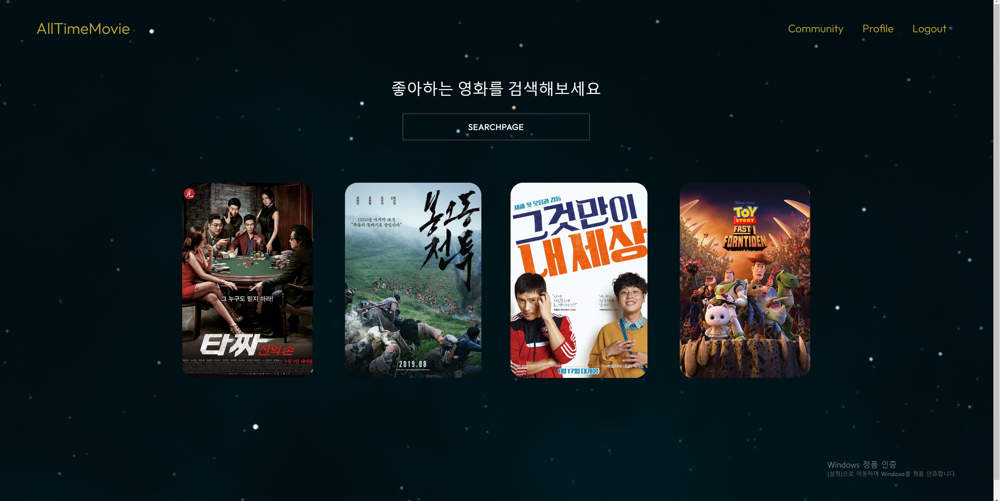
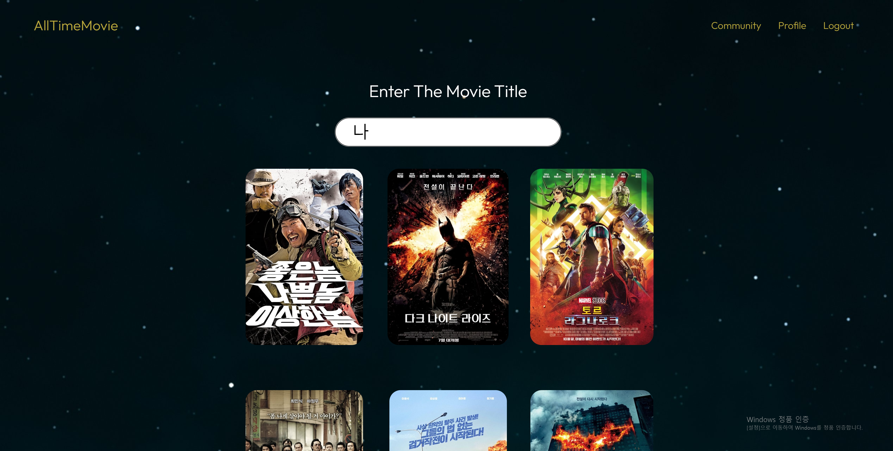

# final-pjt

> Django REST API와 Vue.js를 활용한 영화 정보 제공 서비스

​	

## 1. 팀원 정보 및 진행 과정

### 🙌 팀원

- 최승연
- 홍석준

### 📅 업무 진행과정

> 모든 업무는 함께 진행했습니다.

#### 💪 1일차 (11월 17일)

1. ERD 작성하여 DB모델 구성하기

2. Front
   - Signup / Login / Logout 구현하기

3. Back

   - signup / Login / Logout 구현하기

   - 리뷰 게시글 및 댓글 CRUD 구현하기

     

#### 💪 2일차 (11월 18일)

1. Front

   - 로그아웃 구현 마무리 하기
   - 메인 페이지 구성하기
   - TMDB API를 통해 영화 정보 추가로 가져오기

2. Back

   - 영진위에서 다운받은 영화 데이터 DB에 담기

     

#### 💪 3일차 (11월 19일)

1. Front

   - 메인 페이지와 영화 정보 페이지 구현하기
   - 게시글 및 댓글 CRUD 구현하기

2. Back

   - user 연결을 위해 모델 수정하기

   - 뷰 게시글 및 댓글 CRUD 수정하기

     

#### 💪 4일차 (11월 20일)

1. Front

   - 검색 페이지 완성하기
   - 리뷰 게시글 및 댓글 페이지 전환 자연스럽게 다듬기
   - 별점 CRUD 구현하기

2. Back

   - 별점 CRUD 구현하기

   

#### 💪 5일차 (11월 22일)

1. Front 
   - 별점 CRUD 구현 마무리하기
   - 로그인/아웃 수정해서 완성하기

#### 💪 6일차 (11월 23일)

1. Front
   - 메인 페이지 및 네비게이션 바 구성하기
   - 디테일 페이지 및 커뮤니티 페이지 구현하기
   - signup / Login / Logout 오류 수정하기
2. Back
   - 권한 제한 구현하기

#### 💪 7일차 (11월 24일)

1. Front
   - 프로필 페이지 구성하기
   - 권한 제한 추가로 설정하기
   - 디테일 페이지에 별점 구현하기

#### 💪 8일차 (11월 25일)

1. Back
   - 불필요한 DB 원본 데이터에서 지우기
2. Front
   - 전체적인 화면 구성 수정하기: 화면 전환 및 디자인

## 2. 목표 서비스 구현 및 실제 구현 정도

### 📍 목표 서비스

- Youtube 영상을 연결하여 영화 정보와 함께 관련 영상 서비스
- 사용자가 보기에 편하고 다음 동작이 바로 이어지는 서비스 편리한 서비스 고민해보고 구현하기

### 🎈 실제 구현 정도

- Youtube 영상을 연결하여 서비스 구현은 했으나 유튜브 API 요청횟수 제한으로 시연도 하지 못하고 마무리 됐다.
- 기능 구현에 집중하다보니 사용자가 보기에 편한 서비스를 고민하는 시간이 부족했다. 교수님의 피드백대로 수정하니 팀원끼리만 이야기 했을때보다 훨씬 편한 서비스가 되었다. 자주 접하는 영화 서비스를 구현하면서도 기능 구현에 집중하다가 놓친 부분이 많았다.

## 3. 데이터베이스 모델링 ERD

## 4. 필수 기능

### ⭐ 영화 정보 제공 서비스

### ⭐ 별점 CRUD

### ⭐ 추천 영화 제공 서비스

### ⭐ 영화 커뮤니티 정보 공유 서비스

### ⭐ 영화 기록 서비스

## 5. 배포 서버 URL

없습니다 :)

## 6. 느낀점

### ✏ 최승연

1. 프로젝트 초기에 팀원과 함께 고민한 시간이 협업에 수월했다.

   프로젝트 시작 이틀 정도는 팀원과 함께 진행한 것이 이후 프로젝트 진행에 많은 도움이 됐다. 처음에는 분업해야하지 않을까했지만 이틀정도 소통하면서 진행하니 서로 부족한 부분을 비교적 빠르게 해결하고 프로젝트 이후에도 협업에 수월했다.

2. 수업시간에 배운 내용을 알고 있지만 알고 있는 것이 아니었다.

   프로젝트로 경험을 쌓는다는 것이 중요하다는 것은 알고 있었지만 쉽사리 시작하지 못했었는데 이번 프로젝트를 통해 프로젝트를 왜 해봐야하는지 더 더욱 깨달았다. 스켈레톤 코드 하나 없이 시작하니 알고 있다고 생각한 부분도 모르고 있었다는 것을 많이 깨달았다. 

3. 프로젝트 시작 전에 모델링 고민 많이하기!

   

### ✏ 홍석준

1. 웹 서비스 구현은 모델링이 0순위라고 생각한다. 처음에 ERD로 모델링을 만들고 시작했지만 구현도중 몇번 수정하면서 로직이 바뀌는 경우가 생겼다. 실질적으로 코드를 작성하는 시간보다 모델링을 완성하는 시간이 더 오래 걸렸다.  

2.  비동기 시스템에 대한 이해가 더 필요하다. 실제 상용 서비스들에 비해 적은양의 데이터를 다루지만 데이터를 불러오는 시점과 데이터를 표현하는 시점이 엇갈려 나오는 오류들이 많아 빈번히 오류가 나왔다. 디버깅을 해서 오류를 찾으면 10개중 8개가 데이터 호출 시기가 엇갈리는 부분이었다.
3. 개발자의 기본 소양은 기본기가 제일 중요하다. 실제 코딩테스트도 어렵지 않지만 기본을 요구하는 시험이 많고, 웹 개발 기업은 vanilia JS 이해력을 보는곳이 많다고 들었다. 이번 프로젝트 에서도 vue를 사용하면서 js 기본문법이 필요한 순간이 종종있었지만 공부가 덜 돼 구글링을 자주했다.
4. 간간히 토이프로젝트를 만들어야겠다. 한 학기동안 수업내용을 완전히 이해하는것을 목표로 삼았고, 90%는 달성했다고 생각했다. 이번 관통 프로젝트로 90%를 표출하고자 했으나 60%정도 밖에 표현하지 못했다. 하면서 까먹은 내용들을 다시 복기시켜 나갔다. 이전 내용을 다시 공부하면서 프로젝트를 진행하니 내가 아는 부분과 부족한 부분이 어디인지 명확하게 파악했다.
